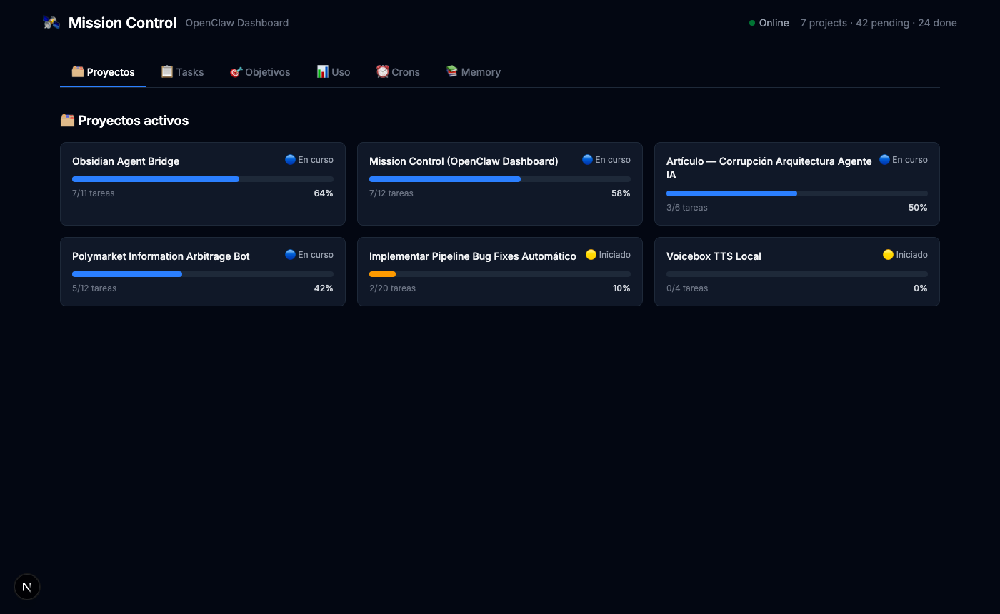
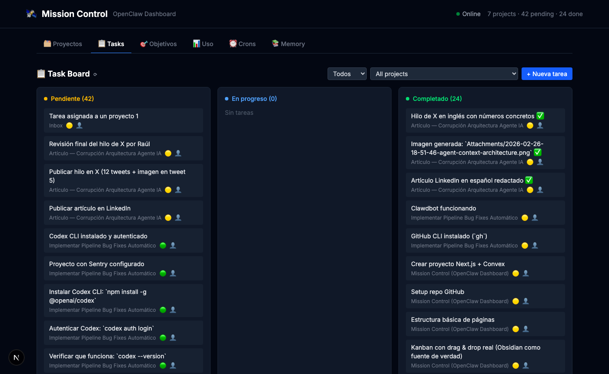
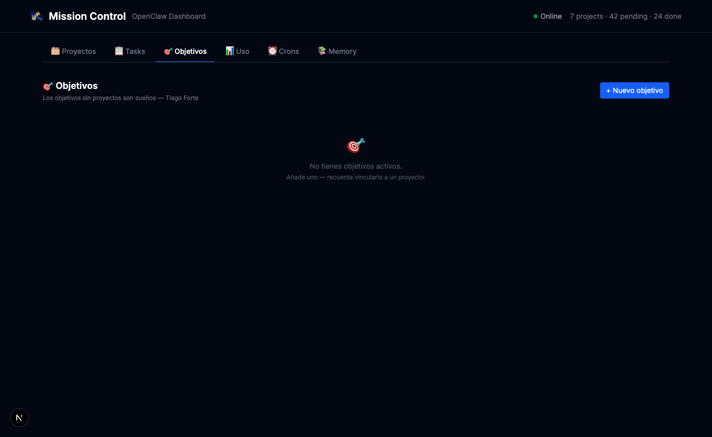
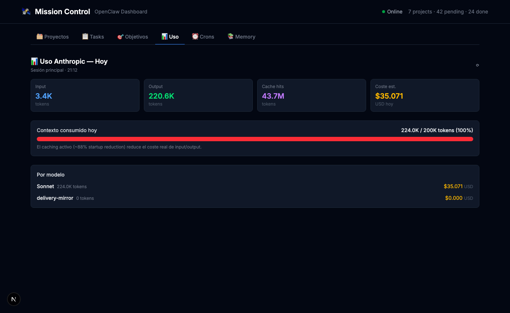
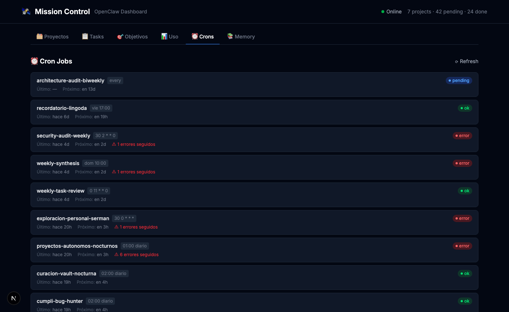

# 🛰️ Mission Control — OpenClaw Dashboard

A local web dashboard for [OpenClaw](https://openclaw.ai) AI agents. Visualize your projects, tasks, goals, cron jobs, memory logs, and AI token usage — all powered directly by your Obsidian vault as the source of truth.



---

## ✨ Features

### 🗂️ Projects Overview
Active Obsidian projects with real-time completion progress bars. See at a glance how far along each project is based on its actual task completion.


### 📋 Task Board
Kanban board (Pending / In Progress / Done) with drag-and-drop support. Tasks are read and written directly to your Obsidian markdown files — no separate database.

- Filter by project or assignee (you vs your AI agent)
- Create tasks linked to specific Obsidian projects via autocomplete
- Tasks land in the correct project file under a `## Tareas` section



### 🎯 Goals
Track short, medium, and long-term goals — linked to real Obsidian projects. Inspired by Tiago Forte's BASB principle: *goals without projects are just dreams*.

- Goals without a linked project are flagged with a warning
- Grouped by timeframe: weeks / months / years
- Full CRUD: create, complete, pause, delete



### 📊 AI Usage
Live token usage from your OpenClaw session — input, output, cache reads, and estimated cost. Includes a context window bar and per-model breakdown.



### ⏰ Cron Jobs
View all scheduled OpenClaw cron jobs with their schedule, last run status, and next execution time.



### 📚 Memory Log
Browse daily memory files generated by your AI agent, with size tracking and excerpts.

---

## 🏗️ Architecture

Mission Control is a **read/write view layer** over your existing data. It does not maintain its own database.

```
Obsidian Vault (source of truth)
    ├── 01 Proyectos/         ← project notes + tasks
    ├── Task Inbox.md         ← uncategorized tasks
    └── Attachments/

OpenClaw (~/.openclaw/)
    ├── cron/jobs.json        ← scheduled jobs
    └── agents/main/sessions/ ← token usage logs

~/clawd/
    ├── goals.json            ← goals (CRUD)
    └── memory/               ← daily notes + context
```

**Stack:** Next.js 16 · TypeScript · Tailwind CSS · No external database

---

## 🚀 Getting Started

### Prerequisites

- [Node.js](https://nodejs.org/) 18+
- [OpenClaw](https://openclaw.ai) installed and configured
- An Obsidian vault with your projects in `01 Proyectos/`

### Installation

```bash
git clone https://github.com/Veregorn/mission-control.git
cd mission-control
npm install
```

### Configuration

By default, Mission Control expects your data at these paths (macOS):

| Data | Default path |
|------|-------------|
| Obsidian vault | `/Users/<you>/Documents/obsidian-vault/Veregorn` |
| OpenClaw dir | `~/.openclaw` |
| Clawd workspace | `~/clawd` |

To customize, set the `CLAWD_DIR` environment variable or edit `src/lib/config.ts` directly.

### Running

```bash
npm run dev
```

Open [http://localhost:3000](http://localhost:3000).

### Build for production

```bash
npm run build
npm start
```

---

## 📁 Project Structure

```
src/
├── app/
│   ├── api/
│   │   ├── tasks/         # GET/POST tasks from Obsidian
│   │   ├── tasks/[id]/    # PATCH/DELETE task by id
│   │   ├── projects/      # GET active Obsidian projects
│   │   ├── goals/         # GET/POST goals (goals.json)
│   │   ├── goals/[id]/    # PATCH/DELETE goal
│   │   ├── crons/         # GET OpenClaw cron jobs
│   │   ├── memory/        # GET daily memory files
│   │   └── usage/         # GET today's token usage
│   └── page.tsx           # Main layout + tab routing
├── components/
│   ├── TaskBoard.tsx       # Kanban with drag & drop
│   ├── ProjectsOverview.tsx# Project cards + progress bars
│   ├── GoalsPanel.tsx      # Goals CRUD
│   ├── UsagePanel.tsx      # Token usage stats
│   ├── CronPanel.tsx       # Cron job viewer
│   ├── MemoryLog.tsx       # Memory file browser
│   └── StatusBar.tsx       # Header stats
└── lib/
    ├── config.ts           # Path configuration
    ├── types.ts            # TypeScript types
    └── parsers.ts          # Markdown/file parsers
```

---

## 🔧 How Tasks Work

Tasks are standard Obsidian checkboxes written directly into markdown files:

```markdown
- [ ] Build the README #high #raul
- [/] Implement project linking #medium #serman
- [x] Setup Next.js project #high #raul
```

**Creating a task with a project:** Mission Control resolves the project name to the actual Obsidian file and appends the task under a `## Tareas` section. If no matching project is found, it falls back to `Task Inbox.md`.

**Updating task status:** The API edits the checkbox character in-place (`[ ]` → `[/]` → `[x]`) without touching anything else in the file.

---

## 🤖 About OpenClaw

[OpenClaw](https://openclaw.ai) is a personal AI agent platform. Mission Control was built as a utility companion — a visual layer on top of the agent's memory, tasks, and automations.

Inspired by [@AlexFinn](https://twitter.com/AlexFinn)'s post on Mission Controls for AI agents (Feb 2026).

---

## 📄 License

MIT
